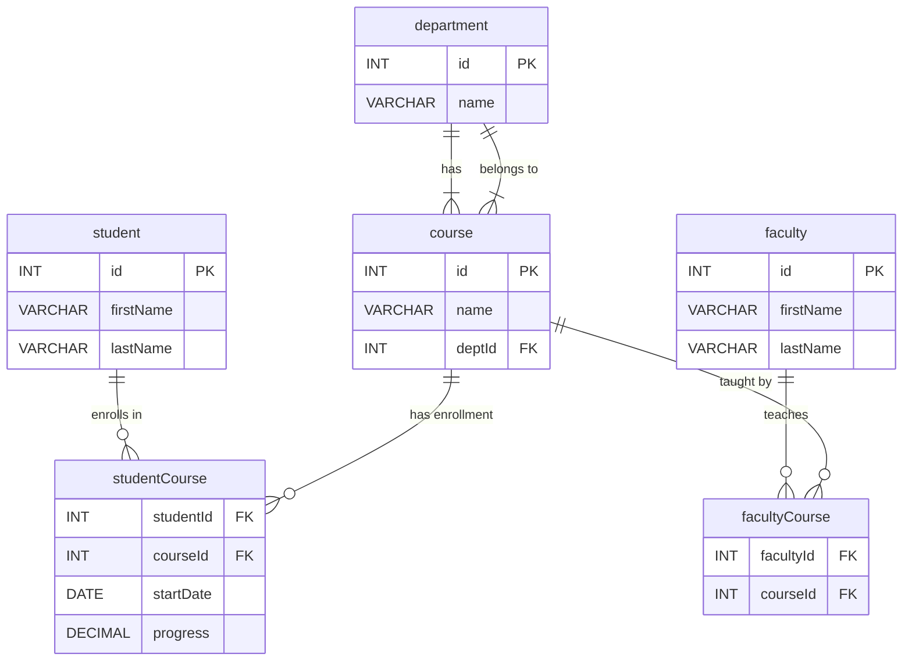

# University Database — Entity Relationship Diagram

## Relationships

| Relationship | Type | Description |
|---|---|---|
| department → course | One-to-Many | A department has many courses; each course belongs to one department |
| student → studentCourse | One-to-Many | A student can enroll in many courses |
| course → studentCourse | One-to-Many | A course can have many enrolled students |
| faculty → facultyCourse | One-to-Many | A faculty member can teach many courses |
| course → facultyCourse | One-to-Many | A course can be taught by many faculty |

> **Note:** `studentCourse` and `facultyCourse` are **junction tables** (also called bridge/join tables). They create many-to-many relationships between student↔course and faculty↔course.
